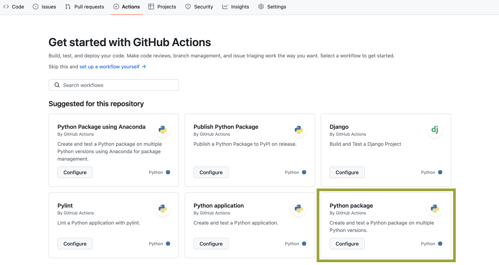
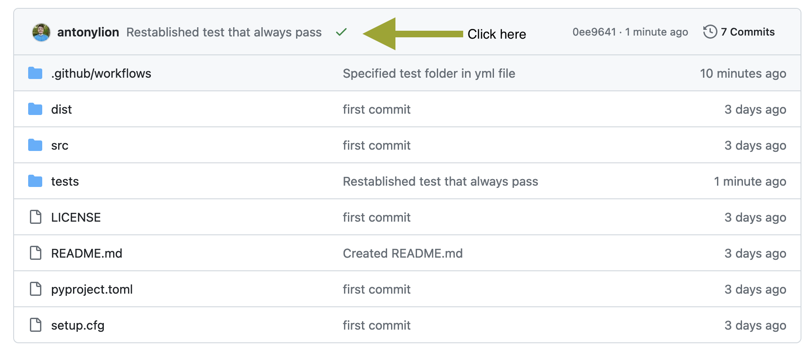
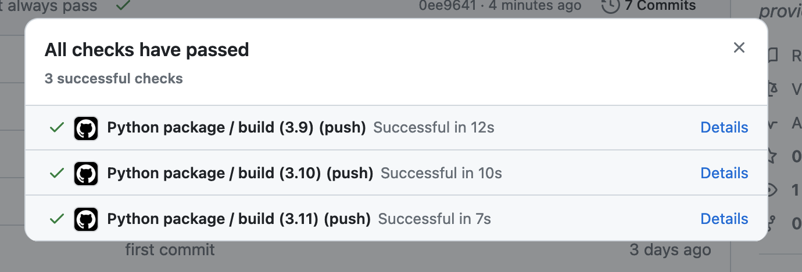

# Software development in MF-DAS

With this tutorial we want to guide you through a tested and functional way of starting your new Python project in MF-DAS. This will hopefully help you and others in understanding and modifying the software you created :)

## Agenda
- Learn how to create, build and install a Python package
- Learn about the GitHub Flow
- Test Driven Development and testing with pytest
- Documenting code
- Publishing a Python package
- Static code analysis tools
- Design by Contract using Deal
Every lesson also include elements of CI/CD since we are going to **automate** all the steps.

## Create, build and install a Python package
This is the the structure we conceive the modern one for a Python project inside MF-DAS

```
├── your_project
│   ├── LICENSE (empty)
│   ├── pyproject.toml
│   ├── setup.cfg (empty)
│   ├── README.md (empty)
│   ├── src/
│   │   ├── example_package/
│   │   │   ├── __init__.py (empty)
│   │   │   ├── example.py
│   ├── tests/
│   │   ├── test_main.py (empty)
```

To start, create these directories and empty files. Tip: if you're working from linux-like terminal, you can create a new empty file with:

```
touch new_file.extension
```

Let's then populate the project configuration file *pyproject.toml*. We will set it to initially install numpy and pandas:

```
[project]
name = "hello-world"
version = "1.0.0"
description "My first Python package"
requires-python = ">=3.8"
authors = [
  {name = "John Doe", email = "john@example.com"},
]
dependencies = [
  "numpy",
  "pandas"
]
```

If your project is structured as above, then build it with:

```
python3 -m pip install --upgrade build
python3 -m build
```

This last command builds the binary distribution package of your project, called wheel. Wheels are a packaging standard that allows for faster installations and a more efficient distribution process of your software.

So we are now ready to install the wheel with pip install:

```
pip install dist/hello_world-1.0.0-py3-none-any.whl
```

Great, you created your package! Let's now create the package version 1.0.1, which acctually contain some code to run :)

Let's put an hello world function inside src/example_package/example.py:

```
def hello():
	print("Hello world!")
```

Now let's update the version of our package in the pyproject.toml file:

```
...
version = "1.0.1"
...
```

Build the new package

```
python3 -m build
```

And install it (the old version is automatically disinstalled):

```
pip install dist/hello_world-1.0.1-py3-none-any.whl
```

Great! Let's now test our package. Open the python3 console:

```
python3
```

Import our module and run the hello function:

```
>>> from example_package import example
>>> example.hello()
Hello world!
```

## The GitHub Flow

Version control enables collaborative development because it:
- Tracks who made changes in the code and what they are
- Allows you to revert back to a previous version of the code
- Allows parallel versions of the software to be developed at the same time and then merged to a single version later

**Git** seems to have eliminated all other version control systems and is pretty much the only game in town. Some terminology:

- *repository*: source code along with the full change history
- *clone*: your own copy of the repository
- *fork*: a copy of the repository that is being independently maintained
- *branch*: a divergent change history that is maintained in parallel with other branches
- *commit*: a smallest unit of change in the source code
- *merge*: incorporate changes from one branch into another one
- *conflict*: occurs when two branches have changes to the same file
- *pull (merge) request*: a request to incorporate changes from a branch to the main branch of the project
- *check out*: update to your local copy of the repository
- *rebase*: incorporate changes made in the main branch to your branch

### Initialize Your GitHub Repository

GitHub is a cloud-based platform that provides hosting for Git repositories, enabling version control, collaborative software development and project management, through their servers. 
To store our Git repository on GitHub we first need to setup authentification correctly. Right now easiest seems to be through the [use of an SSH key](https://docs.github.com/en/authentication/connecting-to-github-with-ssh/generating-a-new-ssh-key-and-adding-it-to-the-ssh-agent).

After setting up authentification, create a [new *empty* repository on GitHub](https://github.com/new). Do NOT add any file (e.g. README, .gitignore, etc.) from the web platform.

Now, from the root folder of your project:

```
git init -b main
git add .
git commit -m "first commit"
git remote add origin git@github.com:/yourusername/name-of-your-github-repo.git
git push -u origin main
```

Congratulations, you just pushed on GitHub your Python package. To finish this section, let's just add a small modification to the package and push the changes to GitHub. We will simply create a README.md file for our package:

```
echo "# Hello World package" > README.md
```

Then:

```
git add README.md
git commit -am "Created README.md"
git push
```

### Setting Up CI/CD for Your GitHub Repository

CI/CD stands for Continous Integration/Continous Deployment. CI/CD involves the automated testing, building, and deployment processes integrated directly into a GitHub repository. When a developer makes changes to the Python package's code, GitHub CI/CD automatically triggers a series of actions, including running tests to ensure the code's integrity and functionality. If the tests pass, the CI/CD pipeline proceeds to build the package and, in a Continuous Deployment setup, deploys it to a specified environment. This automated workflow helps catch errors early in development, ensures consistent code quality, and facilitates efficient and reliable delivery of updates to users. For Python packages, GitHub CI/CD is crucial as it streamlines the development lifecycle, reduces manual intervention, and enables swift and reliable delivery of improvements or new features to end-users.

In order to set up CI/CD for our package, let move to our repository webpage on GitHub. Then click "Actions" in the repo header. So *Configure* Python package:



This will create a new directory called .github/workflows in which you will put your CI/CD scripts in YAML format. By default, GitHus is creating *python-package.yml*. Edit this file such that the last line states the following instruction:
```
pytest tests/
```
We basically said to pytest that everytime we will push code to our repository, all the test contained in the *tests* folder must be completed in order to build the Python package. So, after this modification, just commit this new file via GitHub web by clicking "Commit changes...".

At this point, pull this new commit on your local copy of the repo:

```
git pull
```

Now open the file *tests/test_main.py* and let's define a first test that always pass :)

```
def test_main():
	assert(True)
```

Commit and push this modification to your GitHub repo in the usual way, and investigate the execution log:






### Key components of the GitHub Flow

GitHub Flow is a lightweight, branch-based workflow used for collaborative software development on GitHub. The key components include:

- **Repository:** A storage space where your project and its files are kept, commonly hosted on GitHub.

- **Branch:** A parallel version of a repository, allowing changes to be made without affecting the main or "master" branch.

- **Commit:** A snapshot of changes made to files in a repository, accompanied by a commit message describing the modifications.

- **Merge:** The process of integrating changes from one branch into another, often used to incorporate features or bug fixes into the main branch.

- **Origin:** A shorthand name for the remote repository where your project resides, typically pointing to the repository on GitHub.

- **Remote:** A version of a repository that is hosted on a server, often on platforms like GitHub. "Origin" is a common name for the default remote repository.

**GitHub Flow Process**

1. **Master Branch:** The main branch, often named "master," represents the stable version of the project.

2. **Create a New Branch:** Developers create a new branch when working on a feature or fixing a bug. This keeps changes isolated from the main branch until they're ready.

3. **Commit and Test:** Developers make changes in the new branch, committing snapshots along the way. Testing, including tools like pytest, ensures the changes function as intended.

4. **Merge:** If everything works, the changes are merged back into the master branch. This process helps maintain a clean and stable main branch while allowing for parallel development.

GitHub Flow's simplicity and flexibility make it a popular choice for collaborative development, fostering efficient collaboration among team members.


